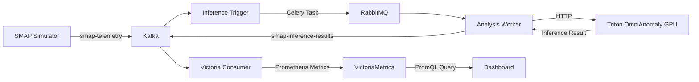

# SMAP Anomaly Detection System

OmniAnomaly 기반 SMAP 위성 텔레메트리 이상 감지 시스템

## 시스템 아키텍처

### 계층 구조
```
위성 (Satellite)
  ├─ SAT-001
  │   ├─ A-1 (Entity - 서브시스템)
  │   │   ├─ sensor_0
  │   │   ├─ sensor_1
  │   │   └─ ... (25개 센서)
  │   ├─ A-2
  │   └─ A-3
  ├─ SAT-002
  │   ├─ D-1
  │   ├─ D-2
  │   └─ E-1
  └─ SAT-003
      ├─ P-1
      ├─ P-2
      └─ G-1
```

### 데이터 흐름



### 서비스 구성

| 서비스 | 설명 | 포트 |
|--------|------|------|
| **triton-omnianomaly** | OmniAnomaly 모델 추론 서버 (GPU) | 8100-8102 |
| **smap-simulator** | SMAP 테스트 데이터 생성 | - |
| **smap-inference-trigger** | Kafka 소비 및 추론 작업 트리거 | - |
| **smap-analysis-worker** | Celery 워커 (추론 실행) | - |
| **smap-victoria-consumer** | 결과를 VictoriaMetrics에 저장 | - |

## 빠른 시작

### 1. 시스템 시작

```bash
bash start-smap.sh
```

### 2. 로그 확인

```bash
# 전체 로그
docker compose -f docker-compose.smap.yml logs -f

# Triton 서버 로그
docker compose -f docker-compose.smap.yml logs -f triton-omnianomaly

# 시뮬레이터 로그
docker compose -f docker-compose.smap.yml logs -f smap-simulator

# 워커 로그
docker compose -f docker-compose.smap.yml logs -f smap-analysis-worker
```

### 3. 서비스 상태 확인

```bash
# Triton 서버 상태
curl http://localhost:8100/v2/health/ready

# 사용 가능한 모델 목록
curl http://localhost:8100/v2/models

# 특정 모델 정보
curl http://localhost:8100/v2/models/smap_A-1
```

### 4. Kafka 토픽 확인

Kafka UI: http://localhost:8080

토픽:
- `smap-telemetry`: 시뮬레이터가 생성한 원시 텔레메트리
- `smap-inference-results`: OmniAnomaly 추론 결과

### 5. VictoriaMetrics 쿼리

VictoriaMetrics UI: http://localhost:8428/vmui

쿼리 예시:
```promql
# 엔티티 A-1의 이상 점수
smap_anomaly_score{entity="A-1"}

# SAT-001의 이상 감지 횟수
sum(increase(smap_anomaly_detected{satellite_id="SAT-001"}[5m]))

# 센서별 재구성 오차
smap_sensor_error{entity="A-1", sensor="sensor_0"}

# 평균 추론 시간
avg(smap_inference_time_ms)
```

## 상세 구성

### OmniAnomaly 모델

- **알고리즘**: VAE (Variational Autoencoder) 기반
- **아키텍처**: GRU (2층) + Encoder + Decoder
- **입력**: 25개 센서 값 (단일 타임스텝)
- **출력**: 재구성 값 (25개), 이상 점수, 이상 여부
- **GPU**: CUDA 지원, KIND_GPU 인스턴스
- **Stateful**: LSTM hidden state 유지

### 훈련된 엔티티 (20개)

- A 시리즈: A-1 ~ A-9
- D 시리즈: D-1 ~ D-4
- E 시리즈: E-1 ~ E-3
- F 시리즈: F-1
- G 시리즈: G-1
- P 시리즈: P-1, P-2

각 엔티티는 독립적인 Triton 모델로 배포됨 (`smap_A-1`, `smap_A-2`, ...)

### Triton 모델 구조

```
triton-omnianomaly/models/
├── smap_A-1/
│   ├── config.pbtxt           # Triton 설정 (GPU, 입출력 정의)
│   └── 1/
│       ├── model.py           # Python Backend (OmniAnomaly 로직)
│       └── model.ckpt         # PyTorch 체크포인트
├── smap_A-2/
├── ...
└── smap_P-2/
```

### VictoriaMetrics 메트릭

| 메트릭 이름 | 설명 | 레이블 |
|-------------|------|--------|
| `smap_anomaly_score` | 전체 이상 점수 (MSE) | satellite_id, entity |
| `smap_anomaly_detected` | 이상 감지 여부 (0/1) | satellite_id, entity |
| `smap_inference_time_ms` | 추론 시간 (ms) | satellite_id, entity |
| `smap_sensor_value` | 센서 실제값 | satellite_id, entity, sensor |
| `smap_sensor_reconstruction` | 센서 재구성값 | satellite_id, entity, sensor |
| `smap_sensor_error` | 센서 재구성 오차 | satellite_id, entity, sensor |
| `smap_inference_error` | 추론 실패 횟수 | satellite_id, entity |

## 개발 가이드

### 새 엔티티 추가

1. 체크포인트 확인:
   ```bash
   ls tranad-sim/checkpoints/OmniAnomaly/model_SMAP_<entity>.ckpt
   ```

2. `setup_models.sh`의 `ENTITIES` 배열에 추가

3. 모델 생성:
   ```bash
   cd triton-omnianomaly
   bash setup_models.sh
   ```

4. Triton 재시작:
   ```bash
   docker compose -f docker-compose.smap.yml restart triton-omnianomaly
   ```

### 시뮬레이터 설정 변경

`smap-simulator/simulator.py`의 `satellite_entities` 매핑 수정:

```python
self.satellite_entities = {
    'SAT-001': ['A-1', 'A-2', 'A-3'],
    'SAT-002': ['D-1', 'D-2', 'E-1'],
    'SAT-003': ['P-1', 'P-2', 'G-1'],
    'SAT-004': ['E-4', 'E-5', 'F-1']  # 새 위성 추가
}
```

### Worker 스케일링

```bash
# Worker 수 증가
docker compose -f docker-compose.smap.yml up -d --scale smap-analysis-worker=4

# Worker 동시성 조정 (docker-compose.smap.yml)
environment:
  - CELERY_CONCURRENCY=8
```

### 임계값 조정

`triton-omnianomaly/models/smap_A-1/1/model.py`의 `self.threshold` 수정:

```python
# POT 방법으로 계산된 임계값 사용
self.threshold = 0.16  # SMAP 기본값
```

## 문제 해결

### Triton 서버가 시작되지 않음

```bash
# GPU 확인
nvidia-smi

# Docker GPU 런타임 확인
docker run --rm --gpus all nvidia/cuda:11.8.0-base-ubuntu22.04 nvidia-smi

# 로그 확인
docker compose -f docker-compose.smap.yml logs triton-omnianomaly
```

### 추론 작업이 실행되지 않음

```bash
# RabbitMQ 확인
curl http://localhost:15672/api/queues

# Celery 워커 로그
docker compose -f docker-compose.smap.yml logs -f smap-analysis-worker

# Inference Trigger 로그
docker compose -f docker-compose.smap.yml logs -f smap-inference-trigger
```

### VictoriaMetrics에 데이터가 없음

```bash
# Victoria Consumer 로그
docker compose -f docker-compose.smap.yml logs -f smap-victoria-consumer

# Kafka 토픽 확인 (Kafka UI)
# http://localhost:8080 → smap-inference-results 토픽

# 수동 쿼리 테스트
curl 'http://localhost:8428/api/v1/query?query=smap_anomaly_score'
```

## 성능 최적화

### GPU 메모리 최적화

- 동시 추론 제한: Triton `instance_group.count = 1`
- 배치 처리 비활성화: `max_batch_size = 0`
- Worker 동시성 조절: `CELERY_CONCURRENCY=4`

### Kafka 처리량 최적화

- Consumer `max_records=100` (배치 소비)
- Producer `linger.ms=10`, `batch.size=16384`
- Kafka retention: 1시간 (개발 환경)

### VictoriaMetrics 저장 최적화

- Retention: 1일 (개발 환경)
- Memory limit: 8GB
- Max timeseries: 10M

## 시스템 종료

```bash
# SMAP 서비스만 종료
docker compose -f docker-compose.smap.yml down

# 전체 시스템 종료
docker compose down
docker compose -f docker-compose.smap.yml down
```

## 다음 단계

1. **프론트엔드 대시보드 확장**
   - 위성/엔티티/센서 선택 UI
   - 실시간 이상 점수 트렌드
   - 센서별 상세 분석

2. **알림 시스템**
   - 이상 감지 시 Slack/Email 알림
   - 임계값 기반 알림 규칙

3. **모델 성능 모니터링**
   - F1, Precision, Recall 계산
   - Ground truth 레이블 활용
   - 모델 재훈련 트리거

4. **추가 알고리즘 지원**
   - TranAD, LSTM-AD, USAD 등
   - 알고리즘별 독립 Triton 서버
