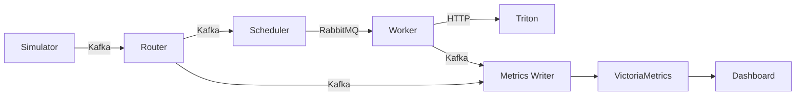

# 위성 텔레메트리 이상 감지 시스템 문서

## 문서 개요

본 문서는 NASA SMAP 위성 데이터 기반 실시간 이상탐지 시스템의 포괄적인 가이드입니다.

---

## 문서 구조

### 1. 사용자 매뉴얼
**파일**: [USER_MANUAL.md](./USER_MANUAL.md)

**대상**: 시스템 운영자, 개발자

**내용**:
- 시스템 시작 및 종료
- 서비스 구성 및 역할
- 데이터 흐름 이해
- 모니터링 방법
- 문제 해결 가이드

### 2. 시스템 설계서
**파일**: [architecture/SYSTEM_ARCHITECTURE.md](./architecture/SYSTEM_ARCHITECTURE.md)

**대상**: 아키텍트, 개발자

**내용**:
- 전체 시스템 아키텍처 (Mermaid 다이어그램)
- 기술 스택 및 선정 이유
- 세부 컴포넌트 설계
- 데이터 모델
- 시퀀스 다이어그램
- 클래스 다이어그램

### 3. API 문서
**파일**: [api/API_REFERENCE.md](./api/API_REFERENCE.md)

**대상**: API 사용자, 프론트엔드 개발자

**내용**:
- REST API 엔드포인트
- WebSocket API
- 요청/응답 형식
- 데이터 모델
- 에러 처리
- 사용 예시 (curl, Python, JavaScript)

### 4. 데이터베이스 문서
**파일**: [database/VICTORIA_METRICS.md](./database/VICTORIA_METRICS.md)

**대상**: 데이터 엔지니어, 개발자

**내용**:
- VictoriaMetrics 구조
- 메트릭 스키마
- PromQL 쿼리 가이드
- 서비스 모니터링 쿼리
- 성능 최적화
- 백업 및 복구

---

## 빠른 시작

### 1. 시스템 시작
```bash
# Kafka 초기화 (최초 1회)
bash init_kafka.sh

# 전체 시스템 시작
docker compose up -d

# 서비스 상태 확인
docker compose ps
```

### 2. 주요 접속 URL

| 서비스 | URL | 설명 |
|--------|-----|------|
| **대시보드** | http://localhost | React 대시보드 |
| **API 서버** | http://localhost/api | REST API |
| **Kafka UI** | http://localhost:8080 | Kafka 모니터링 |
| **Flower** | http://localhost:5555 | Celery 작업 모니터링 |
| **VictoriaMetrics** | http://localhost:8428/vmui | 메트릭 쿼리 UI |
| **RabbitMQ** | http://localhost:15672 | RabbitMQ (guest/guest) |

### 3. 데이터 확인

```bash
# 텔레메트리 데이터
curl 'http://localhost:8428/api/v1/query?query=smap_feature' | jq

# 이상탐지 결과
curl 'http://localhost:8428/api/v1/query?query=inference_anomaly_detected' | jq

# 서비스 로그
docker compose logs -f metrics-writer
```

---

## 시스템 구성

### 서비스 계층

```
┌─────────────────────────────────────────┐
│         Data Source Layer               │
│  - Satellite Simulator (SMAP Data)      │
└─────────────────────────────────────────┘
                  ↓
┌─────────────────────────────────────────┐
│       Message Queue Layer               │
│  - Kafka (Event Streaming)              │
│  - RabbitMQ (Task Queue)                │
└─────────────────────────────────────────┘
                  ↓
┌─────────────────────────────────────────┐
│        Processing Layer                 │
│  - Telemetry Router                     │
│  - Inference Scheduler                  │
│  - Inference Worker                     │
│  - Triton Server (GPU)                  │
└─────────────────────────────────────────┘
                  ↓
┌─────────────────────────────────────────┐
│         Storage Layer                   │
│  - Metrics Writer                       │
│  - VictoriaMetrics (Time Series DB)     │
│  - PostgreSQL (Config DB)               │
└─────────────────────────────────────────┘
                  ↓
┌─────────────────────────────────────────┐
│          API/UI Layer                   │
│  - Operation Server (FastAPI)           │
│  - Frontend (React)                     │
│  - Nginx (Reverse Proxy)                │
└─────────────────────────────────────────┘
```

### 데이터 흐름



---

## 주요 메트릭

### 텔레메트리 메트릭

```promql
# 모든 센서 데이터 (875개 시계열)
smap_feature

# 특정 위성의 EPS 서브시스템
smap_feature{satellite_id="sat1", subsystem="EPS"}
```

### 추론 결과 메트릭

```promql
# 이상탐지 결과
inference_anomaly_detected

# 이상점수 평균
inference_anomaly_score_mean

# 추론 시간
inference_time_ms
```

---

## 시스템 요구사항

### 하드웨어
- **CPU**: 4 cores 이상
- **RAM**: 8GB 이상
- **GPU**: NVIDIA GPU (Triton 추론용)
- **Disk**: 20GB 이상

### 소프트웨어
- **Docker**: 20.10 이상
- **Docker Compose**: v2.0 이상
- **NVIDIA Container Toolkit**: (GPU 사용 시)

---

## 성능 특성

| 항목 | 측정값 |
|------|--------|
| 텔레메트리 처리량 | 5 records/sec |
| 추론 지연시간 | 50-100ms |
| 메트릭 쓰기 속도 | 177 metrics/satellite/sec |
| 쿼리 응답시간 | 2-8ms |
| 시계열 수 | 875개 |
| 추론 작업 생성 | ~106 tasks/batch |

---

## 주요 기술

| 카테고리 | 기술 |
|----------|------|
| **Language** | Python 3.10 |
| **Message Queue** | Kafka (KRaft), RabbitMQ |
| **AI/ML** | Triton Inference Server, ONNX Runtime, TranAD |
| **Storage** | VictoriaMetrics, PostgreSQL 15 |
| **API** | FastAPI |
| **Frontend** | React 18 |
| **Orchestration** | Docker Compose |
| **Task Queue** | Celery |
| **Web Server** | Nginx |

---

## 문제 해결

### 자주 묻는 질문

**Q: 서비스가 시작되지 않아요**
```bash
# Kafka 초기화
rm .env
bash init_kafka.sh
docker compose up -d
```

**Q: 데이터가 수집되지 않아요**
```bash
# 시뮬레이터 확인
docker compose logs satellite-simulator

# metrics-writer 확인
docker compose logs metrics-writer
```

**Q: 추론이 실행되지 않아요**
```bash
# Celery worker 확인
docker compose logs inference-worker

# Flower에서 작업 큐 확인
open http://localhost:5555
```

더 자세한 문제 해결 방법은 [사용자 매뉴얼 - 문제 해결](./USER_MANUAL.md#7-문제-해결)을 참조하세요.

---

## 추가 리소스

### 외부 문서
- [VictoriaMetrics 공식 문서](https://docs.victoriametrics.com/)
- [Prometheus PromQL 가이드](https://prometheus.io/docs/prometheus/latest/querying/basics/)
- [Triton Inference Server](https://github.com/triton-inference-server/server)
- [Celery 문서](https://docs.celeryproject.org/)
- [FastAPI 문서](https://fastapi.tiangolo.com/)

### 내부 리소스
- [CLAUDE.md](../CLAUDE.md) - 프로젝트 컨텍스트
- [docker-compose.yml](../docker-compose.yml) - 서비스 정의
- [SERVICES.md](../SERVICES.md) - 서비스 상세 정보 (deprecated)

---

## 기여 가이드

### 문서 개선

문서 개선 제안은 다음 순서로 진행하세요:

1. 해당 문서 파일 수정
2. Mermaid 다이어그램이 있다면 [Mermaid Live Editor](https://mermaid.live/)에서 검증
3. 마크다운 린팅 실행
4. Pull Request 생성

### 문서 스타일 가이드

- 제목은 명사형 사용
- 코드 블록에 언어 지정 (```bash, ```python, ```promql)
- Mermaid 다이어그램 적극 활용
- 예제 코드는 실행 가능한 형태로 제공
- 복잡한 개념은 표와 다이어그램으로 설명

---

## 라이선스

이 프로젝트는 NASA SMAP 오픈 데이터셋을 기반으로 합니다.

---

## 연락처

문의사항이나 제안사항이 있으시면 Issue를 생성해주세요.

---

*마지막 업데이트: 2025-11-12*
