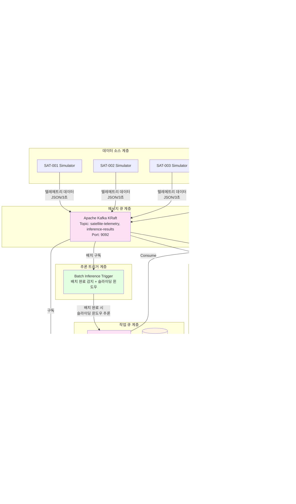

# 위성 텔레메트리 분석 시스템 - 시스템 아키텍처

## 1. 시스템 개요 (High-Level Architecture)


**핵심 아키텍처**:
-  **비동기 스트리밍**: 위성 데이터가 Kafka를 통해 실시간으로 전달
-  **배치 기반 추론**: Kafka에서 배치 텔레메트리를 수신하여 배치 완료 시 슬라이딩 윈도우로 추론 실행
-  **데이터 분리**: PostgreSQL은 시스템 설정값 전용, VictoriaMetrics는 모든 시계열 데이터와 추론 결과 저장
-  **실시간 대시보드**: WebSocket으로 브라우저에 즉시 업데이트

---

## 2. 데이터베이스 역할 분리

### PostgreSQL - 시스템 설정값 전용
- **system_config**: Triton, Kafka, VictoriaMetrics 등 시스템 전역 설정
- **model_config**: 모델별 추론 파라미터 및 설정
- **satellite_config**: 위성별 모니터링 설정
- **kafka_topic_config**: Kafka 토픽 설정
- **victoria_metrics_config**: VictoriaMetrics 메트릭 설정

### VictoriaMetrics - 시계열 데이터 + 추론 결과
- **텔레메트리 데이터**: 위성의 모든 센서 데이터
- **추론 결과 메트릭**:
  - `inference_anomaly_score`: 이상 감지 점수
  - `inference_anomaly_detected`: 이상 감지 여부
  - `inference_time_ms`: 추론 시간
  - `inference_prediction_mean/std/min/max`: 예측값 통계
  - `inference_confidence_mean`: 신뢰도 평균
  - `inference_job_status`: 작업 상태

---

## 3. 전체 시스템 구성도 (상세)



## 4. 데이터 플로우

### 4.1 실시간 텔레메트리 수집 & 저장


### 4.2 자동 AI 추론 파이프라인 (배치 기반 슬라이딩 윈도우)


**배치 기반 추론의 장점:**
- ✅ **현실적인 시나리오**: 위성-지상국 교신 시 배치 전송 방식 모사
- ✅ **슬라이딩 윈도우**: 한 배치에서 여러 윈도우 추론으로 정확도 향상
- ✅ **유연한 배치 크기**: 수십초~수십분의 다양한 배치 기간 지원
- ✅ **확장성**: Kafka Consumer Group으로 수평 확장 가능
- ✅ **신뢰성**: 배치 완료 보장 메커니즘 (is_last_record)

### 4.3 추론 트리거 메커니즘 (배치 완료 기반 슬라이딩 윈도우)


## 5. 서브시스템별 모델 매핑


### 입력 특징 상세

**EPS (12개 특징):**
```
satellite_battery_voltage, satellite_battery_soc, satellite_battery_current,
satellite_battery_temp, satellite_solar_panel_1_voltage, satellite_solar_panel_1_current,
satellite_solar_panel_2_voltage, satellite_solar_panel_2_current,
satellite_solar_panel_3_voltage, satellite_solar_panel_3_current,
satellite_power_consumption, satellite_power_generation
```

**Thermal (6개 특징):**
```
satellite_temp_battery, satellite_temp_obc, satellite_temp_comm,
satellite_temp_payload, satellite_temp_solar_panel, satellite_temp_external
```

**AOCS (12개 특징):**
```
satellite_gyro_x, satellite_gyro_y, satellite_gyro_z, satellite_sun_angle,
satellite_mag_x, satellite_mag_y, satellite_mag_z,
satellite_wheel_1_rpm, satellite_wheel_2_rpm, satellite_wheel_3_rpm,
satellite_altitude, satellite_velocity
```

**Comm (3개 특징):**
```
satellite_rssi, satellite_data_backlog, satellite_last_contact
```

## 6. 주요 기술 스택


## 7. 컨테이너 배포 구성

| 서비스명 | 이미지 | 포트 | 역할 |
|---------|--------|------|------|
| kafka | confluentinc/cp-kafka | 9092 | 메시지 스트리밍 |
| rabbitmq | rabbitmq:3-management | 5672, 15672 | 작업 큐 |
| postgres | postgres:latest | 5432 | 시스템 설정값 저장 |
| triton-server | 커스텀 빌드 | 8500-8502 | GPU 추론 |
| analysis-worker-1 | 커스텀 빌드 | - | Celery Worker |
| **victoria-inference-trigger** | **커스텀 빌드** | **-** | **VictoriaMetrics 기반 추론 트리거** |
| operation-server | 커스텀 빌드 | 8000 | API 서버 |
| victoria-metrics | victoriametrics/victoria-metrics | 8428 | 시계열 + 추론 결과 DB |
| victoria-consumer | 커스텀 빌드 | - | 모든 데이터 저장 |
| frontend | satlas-ui:latest | - | React UI |
| nginx | nginx:alpine | 80 | 웹 서버 |
| flower | 커스텀 빌드 | 5555 | Celery 모니터 |
| kafka-ui | provectuslabs/kafka-ui | 8080 | Kafka 모니터 |
| elasticsearch | elasticsearch:8.5.0 | 9200 | 검색 엔진 |

## 8. 추론 트리거 설정

### 환경 변수
```yaml
victoria-inference-trigger:
  environment:
    - VICTORIA_METRICS_URL=http://victoria-metrics:8428
    - INFERENCE_INTERVAL_SECONDS=30          # 30초마다 새 데이터 확인
    - SEQUENCE_LENGTH=30                     # 30개 데이터 포인트 (90초)
    - FORECAST_HORIZON=10                    # 10스텝 예측 (30초)
```

### 동작 로직
1. **활성 위성 조회**: VictoriaMetrics에서 최근 데이터를 보낸 위성 목록 조회
2. **최신 타임스탬프 확인**: 각 위성의 최신 텔레메트리 타임스탬프 조회
3. **추론 필요 여부 판단**: 마지막 추론 이후 30초 이상 경과 시 추론 트리거
4. **데이터 수집**: VictoriaMetrics에서 서브시스템별 30개 데이터 포인트 조회
5. **Celery 태스크 생성**: 각 서브시스템(EPS, Thermal, AOCS, Comm)별 추론 태스크 생성

## 9. 확장성 및 성능

### 수평 확장
- **Analysis Worker**: `docker compose up --scale analysis-worker-1=4`로 워커 수 증가
- **Kafka Partitions**: 토픽 파티션 수 증가로 처리량 향상
- **Celery Concurrency**: 워커당 동시 처리 수 조정

### GPU 활용
- Triton Server는 Dynamic Batching으로 여러 요청을 자동으로 배치 처리
- CUDA 13.0 기반 최적화된 추론

### 효율적인 데이터 조회
- VictoriaMetrics의 PromQL로 효율적인 시계열 데이터 조회
- Range Query로 필요한 데이터만 정확하게 조회
- 메트릭별 독립적 조회로 병렬 처리 가능

## 10. 장애 복구 & 안정성

### Health Checks
- Triton Server: HTTP health endpoint
- RabbitMQ: rabbitmq-diagnostics ping
- PostgreSQL: 자동 재시작
- VictoriaMetrics: HTTP health endpoint

### 데이터 영속성
- PostgreSQL: `postgres_data` 볼륨 (설정값)
- Kafka: `kafka_data` 볼륨
- VictoriaMetrics: `victoria_data` 볼륨 (시계열 + 추론 결과)
- Elasticsearch: `es_data` 볼륨

### 에러 핸들링
- Celery task retry 메커니즘
- Victoria Inference Trigger: 연속 실행 루프, 오류 시 10초 대기 후 재시도
- 모든 서비스에 restart: unless-stopped 정책

## 11. 시스템 특징 요약

### 완전 자동화된 추론
- ❌ **조건부 트리거 없음**: 배터리 부족, 온도 이상 등의 조건 불필요
- ❌ **수동 추론 없음**: 운영자가 수동으로 추론 요청할 필요 없음
- ✅ **데이터 기반 추론**: 새로운 텔레메트리 데이터가 저장되면 자동으로 추론
- ✅ **일관성**: 모든 위성, 모든 서브시스템에 대해 동일하게 처리

### 아키텍처 단순화
- VictoriaMetrics를 단일 진실 소스(Single Source of Truth)로 사용
- 복잡한 조건 로직 제거
- 시계열 데이터베이스의 강점 활용
