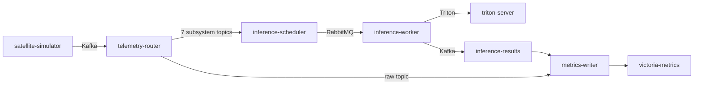
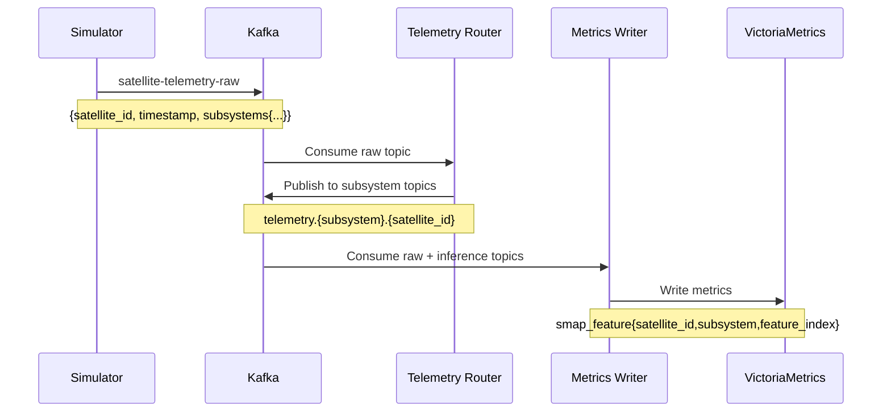
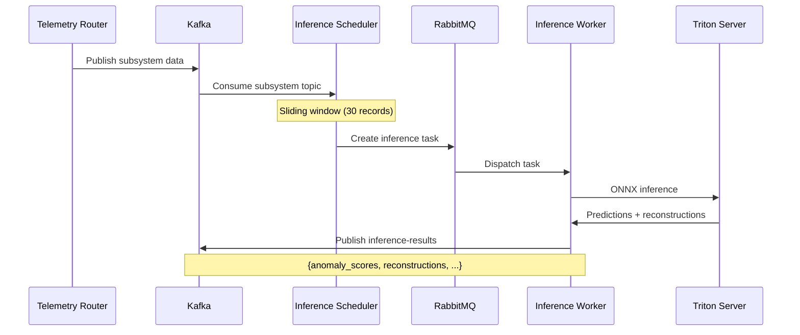

# 사용자 매뉴얼

## 목차
1. [시스템 개요](#1-시스템-개요)
2. [시스템 시작](#2-시스템-시작)
3. [서비스 구성](#3-서비스-구성)
4. [데이터 흐름](#4-데이터-흐름)
5. [모니터링](#5-모니터링)
6. [데이터 확인](#6-데이터-확인)
7. [문제 해결](#7-문제-해결)

---

## 1. 시스템 개요

위성 텔레메트리 이상 감지 시스템은 NASA SMAP 위성 데이터를 기반으로 실시간 이상탐지를 수행하는 분산 시스템입니다.

### 주요 기능
- 5개 위성의 7개 서브시스템(ACS, Data, EPS, FSW, PS, SS, TCS) 모니터링
- 각 서브시스템당 25개 특징 실시간 수집
- ONNX 기반 딥러닝 모델을 통한 이상탐지
- 슬라이딩 윈도우(30레코드, 10레코드 stride) 추론
- VictoriaMetrics를 통한 시계열 데이터 저장 및 조회

### 시스템 요구사항
- Docker 및 Docker Compose
- NVIDIA GPU (Triton 추론 서버용)
- 최소 8GB RAM
- 20GB 디스크 공간

---

## 2. 시스템 시작

### 2.1 초기 설정

Kafka 클러스터 ID를 초기화합니다 (최초 1회만 실행):
```bash
bash init_kafka.sh
```

### 2.2 전체 시스템 시작

```bash
docker compose up -d
```

또는:
```bash
bash start.sh
```

### 2.3 시스템 종료

```bash
docker compose down
```

### 2.4 서비스 상태 확인

```bash
docker compose ps
```

모든 서비스가 `Up` 또는 `healthy` 상태여야 합니다.

---

## 3. 서비스 구성

### 3.1 인프라 계층

| 서비스 | 포트 | 설명 |
|--------|------|------|
| **kafka** | 9092 | 이벤트 스트리밍 (KRaft 모드) |
| **rabbitmq** | 5672, 15672 | Celery 작업 큐 |
| **victoria-metrics** | 8428 | 시계열 데이터베이스 |
| **postgres** | 5432 | 시스템 설정 DB |

### 3.2 데이터 파이프라인



| 서비스 | 역할 |
|--------|------|
| **satellite-simulator** | 위성 텔레메트리 데이터 생성 (SMAP 데이터셋 재생) |
| **telemetry-router** | 서브시스템별 토픽 라우팅 |
| **inference-scheduler** | 슬라이딩 윈도우 추론 작업 스케줄링 |
| **inference-worker** | Celery 워커, Triton 추론 실행 |
| **triton-server** | ONNX 모델 추론 서버 (GPU) |
| **metrics-writer** | VictoriaMetrics 데이터 저장 |

### 3.3 API/UI 계층

| 서비스 | 포트 | 접속 URL | 설명 |
|--------|------|----------|------|
| **nginx** | 80 | http://localhost | 리버스 프록시 |
| **frontend** | - | http://localhost | React 대시보드 |
| **operation-server** | 8003 | http://localhost/api | FastAPI REST API |

### 3.4 모니터링 계층

| 서비스 | 포트 | 접속 URL | 설명 |
|--------|------|----------|------|
| **kafka-ui** | 8080 | http://localhost:8080 | Kafka 토픽/메시지 모니터링 |
| **flower** | 5555 | http://localhost:5555 | Celery 작업 모니터링 |
| **victoria-metrics** | 8428 | http://localhost:8428/vmui | 메트릭 쿼리 UI |

---

## 4. 데이터 흐름

### 4.1 텔레메트리 데이터 수집



### 4.2 추론 실행 흐름



---

## 5. 모니터링

### 5.1 Kafka 모니터링 (Kafka UI)

**접속**: http://localhost:8080

**확인 항목**:
- 토픽 목록: `satellite-telemetry-raw`, `telemetry.*`, `inference-results`
- 메시지 수: 실시간 메시지 생성 확인
- Consumer Group: `victoria-consumer-group-*`, `inference-scheduler-*`

### 5.2 Celery 작업 모니터링 (Flower)

**접속**: http://localhost:5555

**확인 항목**:
- Active Workers: 1개 이상
- Tasks: `analysis-worker.tasks.run_inference_task`
- Success Rate: 추론 성공률
- Task Queue: 대기 중인 작업 수

### 5.3 VictoriaMetrics UI (VMUI)

**접속**: http://localhost:8428/vmui

**기본 쿼리**:
```promql
# 전체 텔레메트리 데이터
smap_feature

# 특정 위성의 EPS 서브시스템
smap_feature{satellite_id="sat1", subsystem="EPS"}

# 이상탐지 결과
inference_anomaly_detected

# 이상점수 평균
inference_anomaly_score_mean
```

### 5.4 서비스 로그 확인

```bash
# 전체 서비스 로그
docker compose logs -f

# 특정 서비스 로그
docker compose logs -f satellite-simulator
docker compose logs -f telemetry-router
docker compose logs -f inference-scheduler
docker compose logs -f inference-worker
docker compose logs -f metrics-writer

# 최근 100줄만 확인
docker compose logs --tail=100 metrics-writer
```

---

## 6. 데이터 확인

### 6.1 텔레메트리 데이터 확인

#### VMUI에서 확인
1. http://localhost:8428/vmui 접속
2. Query 입력: `smap_feature{satellite_id="sat1"}`
3. Execute 클릭
4. Graph 탭에서 시계열 그래프 확인

#### curl로 확인
```bash
# 모든 텔레메트리 메트릭
curl -s 'http://localhost:8428/api/v1/query?query=smap_feature' | jq

# 특정 위성+서브시스템
curl -s 'http://localhost:8428/api/v1/query?query=smap_feature{satellite_id="sat1",subsystem="EPS"}' | jq

# 총 시계열 수 (875개 예상)
curl -s 'http://localhost:8428/api/v1/query?query=count(smap_feature)' | jq -r '.data.result[0].value[1]'
```

### 6.2 추론 결과 확인

#### 이상탐지 결과
```bash
# 이상이 탐지된 서브시스템
curl -s 'http://localhost:8428/api/v1/query?query=inference_anomaly_detected' \
  | jq -r '.data.result[] | select(.value[1]=="1") | "\(.metric.satellite_id) \(.metric.subsystem): ANOMALY"'
```

#### 이상점수 확인
```bash
# 평균 이상점수 상위 5개
curl -s 'http://localhost:8428/api/v1/query?query=topk(5,inference_anomaly_score_mean)' \
  | jq -r '.data.result[] | "\(.metric.satellite_id) \(.metric.subsystem): \(.value[1])"'
```

#### 추론 성능 확인
```bash
# 추론 시간 통계
curl -s 'http://localhost:8428/api/v1/query?query=avg(inference_time_ms)' \
  | jq -r '.data.result[0].value[1]'
```

### 6.3 메트릭 레이블 확인

```bash
# 사용 가능한 메트릭 이름
curl -s 'http://localhost:8428/api/v1/label/__name__/values' | jq -r '.data[]'

# satellite_id 목록
curl -s 'http://localhost:8428/api/v1/label/satellite_id/values' | jq -r '.data[]'

# subsystem 목록
curl -s 'http://localhost:8428/api/v1/label/subsystem/values' | jq -r '.data[]'
```

---

## 7. 문제 해결

### 7.1 서비스가 시작되지 않음

#### Kafka 초기화 오류
```bash
# .env 파일 삭제 후 재초기화
rm .env
bash init_kafka.sh
docker compose up -d kafka
```

#### PostgreSQL 연결 오류
```bash
# healthcheck 완료 후 재시작
docker compose restart operation-server
```

#### RabbitMQ 연결 실패
```bash
# RabbitMQ 로그 확인
docker compose logs rabbitmq

# 의존 서비스 재시작
docker compose restart inference-scheduler inference-worker
```

### 7.2 데이터가 수집되지 않음

#### 시뮬레이터 확인
```bash
# 시뮬레이터 로그
docker compose logs satellite-simulator --tail=50

# 실행 중인지 확인
docker compose ps satellite-simulator
```

#### Kafka 토픽 확인
```bash
# 토픽 목록
docker exec kafka kafka-topics --bootstrap-server localhost:9092 --list

# 메시지 확인
docker exec kafka kafka-console-consumer \
  --bootstrap-server localhost:9092 \
  --topic satellite-telemetry-raw \
  --max-messages 1
```

#### VictoriaMetrics 확인
```bash
# 메트릭 개수
curl -s 'http://localhost:8428/api/v1/label/__name__/values' | jq -r '.data[] | select(startswith("smap"))'
```

### 7.3 추론 작업이 실행되지 않음

#### Celery Worker 확인
```bash
# Worker 로그
docker compose logs inference-worker -f

# Flower에서 확인
open http://localhost:5555
```

#### RabbitMQ 큐 확인
```bash
# RabbitMQ Management
open http://localhost:15672
# ID/PW: guest/guest

# Queues 탭에서 메시지 확인
```

#### Triton 서버 확인
```bash
# Triton 서버 상태
curl http://localhost:8000/v2/health/ready

# 로드된 모델 목록
curl http://localhost:8000/v2/models | jq
```

### 7.4 디스크 공간 부족

#### Kafka 데이터 정리
```bash
# Kafka 데이터 보존 설정 (docker-compose.yml)
KAFKA_LOG_RETENTION_HOURS: 1
KAFKA_LOG_RETENTION_BYTES: 104857600  # 100MB
```

#### VictoriaMetrics 데이터 정리
```bash
# 볼륨 삭제 (모든 데이터 삭제)
docker compose down
docker volume rm telemetry_anomaly_det_victoria_data
docker compose up -d
```

#### 로그 파일 정리
```bash
# Docker 로그 정리
docker system prune -a --volumes
```

### 7.5 성능 이슈

#### 메모리 부족
```bash
# VictoriaMetrics 메모리 제한 조정 (docker-compose.yml)
mem_limit: 8g
--memory.allowedPercent=80
```

#### 추론 속도 저하
```bash
# Worker 수 증가
docker compose up -d --scale inference-worker=4

# Celery concurrency 조정 (docker-compose.yml)
CELERY_CONCURRENCY: 4
```

### 7.6 특정 서비스 재시작

```bash
# 단일 서비스 재시작
docker compose restart <service-name>

# 예시
docker compose restart metrics-writer
docker compose restart inference-worker

# 재빌드 필요 시
docker compose stop <service-name>
docker compose rm -f <service-name>
docker compose build <service-name>
docker compose up -d <service-name>
```

---

## 부록

### A. 환경 변수

주요 환경 변수는 docker-compose.yml에 정의되어 있습니다:

| 변수 | 기본값 | 설명 |
|------|--------|------|
| KAFKA_BOOTSTRAP_SERVERS | kafka:9092 | Kafka 서버 주소 |
| VICTORIA_METRICS_URL | http://victoria-metrics:8428 | VictoriaMetrics URL |
| POSTGRES_HOST | postgres | PostgreSQL 호스트 |
| TRITON_SERVER_URL | triton-server:8000 | Triton 서버 URL |
| WINDOW_SIZE | 30 | 추론 윈도우 크기 |
| STRIDE | 10 | 슬라이딩 윈도우 stride |

### B. 포트 목록

| 포트 | 서비스 | 용도 |
|------|--------|------|
| 80 | nginx | 메인 웹 인터페이스 |
| 5432 | postgres | PostgreSQL |
| 5555 | flower | Celery 모니터링 |
| 5672 | rabbitmq | RabbitMQ AMQP |
| 8000 | triton-server | Triton HTTP |
| 8003 | operation-server | FastAPI |
| 8080 | kafka-ui | Kafka UI |
| 8428 | victoria-metrics | VictoriaMetrics |
| 9092 | kafka | Kafka |
| 15672 | rabbitmq | RabbitMQ Management |

### C. 데이터 볼륨

```bash
# 볼륨 목록
docker volume ls | grep telemetry_anomaly_det

# 볼륨 정보
docker volume inspect telemetry_anomaly_det_kafka_data
docker volume inspect telemetry_anomaly_det_victoria_data
docker volume inspect telemetry_anomaly_det_postgres_data
```
