# 시스템 설계서

## 목차
1. [시스템 개요](#1-시스템-개요)
2. [전체 아키텍처](#2-전체-아키텍처)
3. [기술 스택](#3-기술-스택)
4. [세부 컴포넌트](#4-세부-컴포넌트)
5. [데이터 모델](#5-데이터-모델)
6. [시퀀스 다이어그램](#6-시퀀스-다이어그램)

---

## 1. 시스템 개요

### 1.1 프로젝트 목표

NASA SMAP (Soil Moisture Active Passive) 위성 텔레메트리 데이터를 기반으로 실시간 이상탐지를 수행하는 분산 처리 시스템 구축.

### 1.2 핵심 요구사항

- **실시간 처리**: 1초 간격 텔레메트리 데이터 실시간 수집 및 처리
- **분산 추론**: 슬라이딩 윈도우 기반 병렬 이상탐지 추론
- **확장성**: 위성 수, 서브시스템 수 확장 가능한 아키텍처
- **모니터링**: 전체 파이프라인 상태 및 이상탐지 결과 시각화

### 1.3 시스템 규모

- **위성 수**: 5개 (확장 가능)
- **서브시스템**: 7개 (ACS, Data, EPS, FSW, PS, SS, TCS)
- **특징 수**: 서브시스템당 25개
- **데이터 속도**: 5 records/sec (위성당 1 record/sec)
- **추론 윈도우**: 30 records (30초)
- **추론 주기**: 10 records stride (10초)

---

## 2. 전체 아키텍처

### 2.1 시스템 구성도

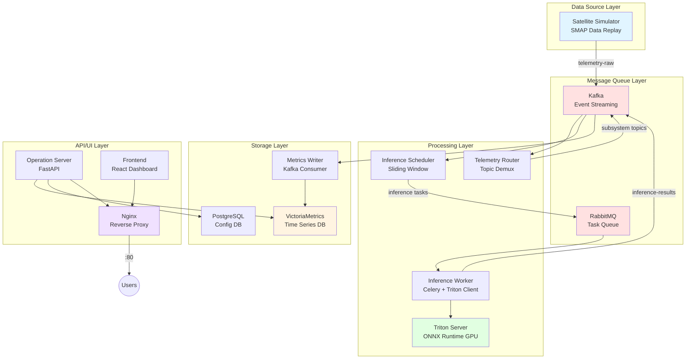

### 2.2 계층별 역할

| 계층 | 역할 | 기술 |
|------|------|------|
| **Data Source** | 위성 텔레메트리 데이터 생성 | Python, Kafka Producer |
| **Message Queue** | 이벤트 스트리밍 및 작업 큐 | Kafka, RabbitMQ |
| **Processing** | 데이터 라우팅, 추론 스케줄링, AI 추론 | Python async, Celery, Triton |
| **Storage** | 시계열 데이터 저장 및 쿼리 | VictoriaMetrics, PostgreSQL |
| **API/UI** | REST API 및 사용자 인터페이스 | FastAPI, React, Nginx |

---

## 3. 기술 스택

### 3.1 핵심 기술

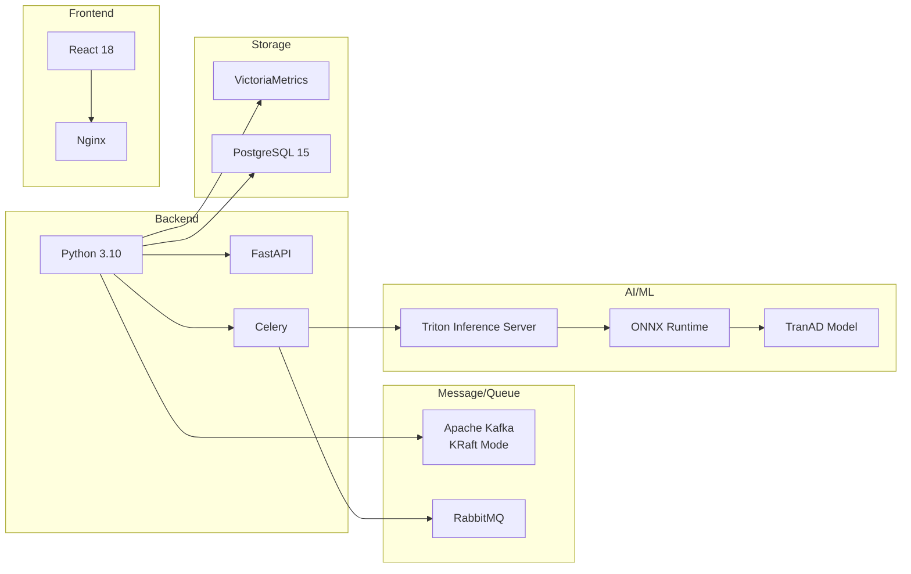

### 3.2 기술 선정 이유

#### Apache Kafka (이벤트 스트리밍)
- **선정 이유**:
  - 높은 처리량 (millions messages/sec)
  - 토픽 기반 pub/sub 패턴
  - 데이터 복제 및 내구성
- **사용 사례**:
  - 텔레메트리 데이터 스트리밍
  - 서브시스템별 토픽 라우팅
  - 추론 결과 배포

#### RabbitMQ (작업 큐)
- **선정 이유**:
  - Celery와 완벽한 통합
  - 작업 우선순위 및 재시도 지원
  - 낮은 지연시간
- **사용 사례**:
  - 추론 작업 분산 처리
  - Worker 로드 밸런싱

#### Triton Inference Server (추론 서버)
- **선정 이유**:
  - ONNX 런타임 지원
  - GPU 가속
  - 동적 배치 처리
  - HTTP/gRPC API
- **사용 사례**:
  - 27개 SMAP 모델 서빙
  - 배치 추론 최적화

#### VictoriaMetrics (시계열 DB)
- **선정 이유**:
  - Prometheus 호환 (PromQL)
  - 낮은 메모리 사용량
  - 빠른 쿼리 성능
  - 수평 확장 가능
- **사용 사례**:
  - 텔레메트리 데이터 저장 (875개 시계열)
  - 추론 결과 저장
  - 대시보드 쿼리

#### PostgreSQL (관계형 DB)
- **선정 이유**:
  - ACID 트랜잭션
  - JSON 지원
  - 안정성 및 성숙도
- **사용 사례**:
  - 시스템 설정 저장
  - 모델 메타데이터 관리

---

## 4. 세부 컴포넌트

### 4.1 데이터 소스 계층

#### Satellite Simulator

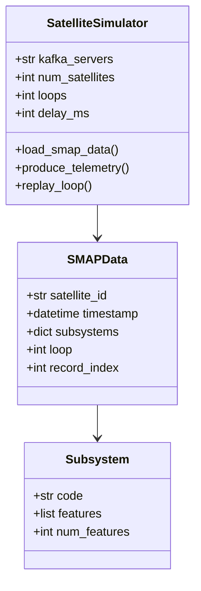

**역할**:
- NASA SMAP 데이터셋 로드 및 재생
- Kafka `satellite-telemetry-raw` 토픽으로 전송
- 5개 위성 데이터 동시 전송

**데이터 구조**:
```json
{
  "satellite_id": "sat1",
  "timestamp": "2025-11-12T10:00:00+00:00",
  "loop": 1,
  "record_index": 1080,
  "subsystems": {
    "ACS": {
      "code": "A",
      "features": [10.0, 0.5, ...],
      "num_features": 25
    },
    "EPS": {...},
    ...
  }
}
```

### 4.2 메시지 큐 계층

#### Kafka Topics

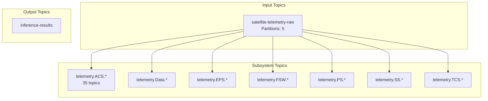

**토픽 명명 규칙**:
- Raw: `satellite-telemetry-raw`
- Subsystem: `telemetry.{subsystem}.{satellite_id}`
- Results: `inference-results`

### 4.3 처리 계층

#### Telemetry Router

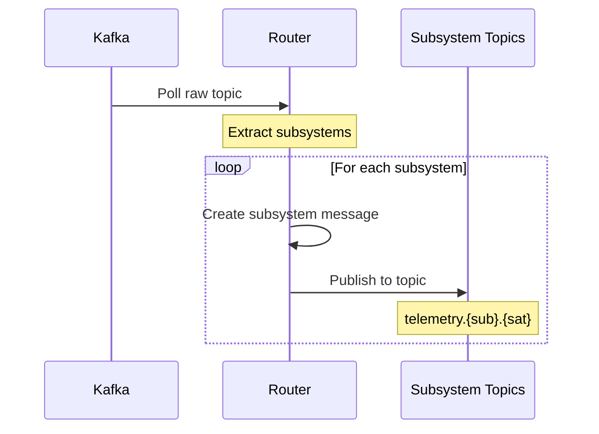

**기능**:
- Raw 토픽 소비
- 서브시스템별로 메시지 분리
- 7개 서브시스템 × 5개 위성 = 35개 토픽 생성

#### Inference Scheduler

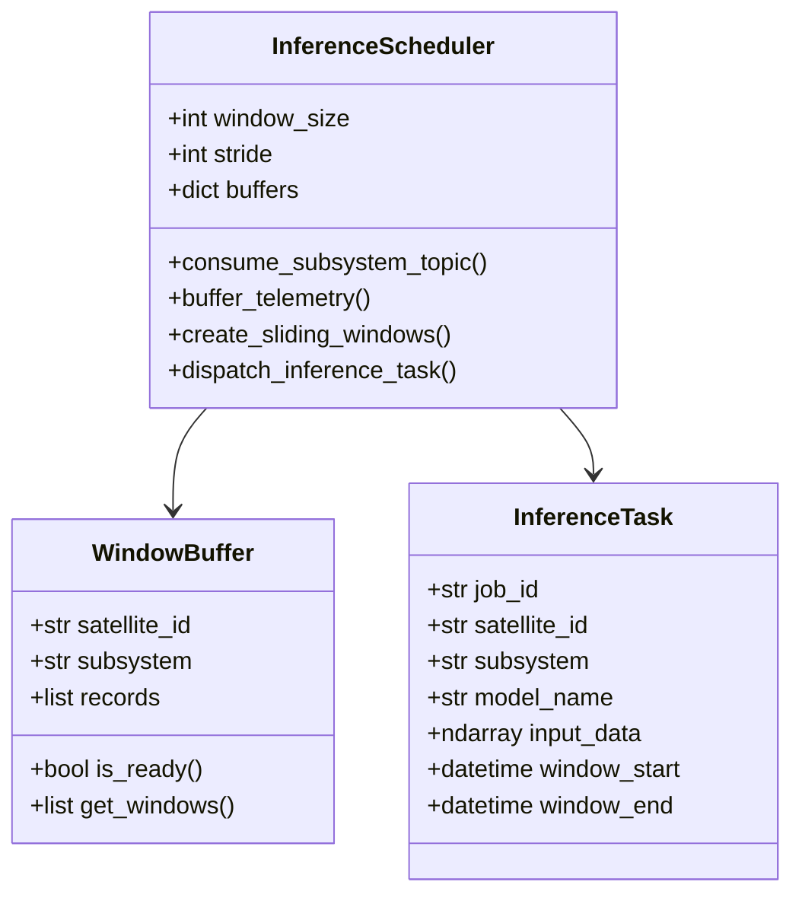

**슬라이딩 윈도우 로직**:
```
Window Size: 30 records
Stride: 10 records

Records: [0, 1, 2, ..., 99]

Window 1: [0..29]   -> inference
Window 2: [10..39]  -> inference
Window 3: [20..49]  -> inference
...
Window N: [70..99]  -> inference
```

#### Inference Worker

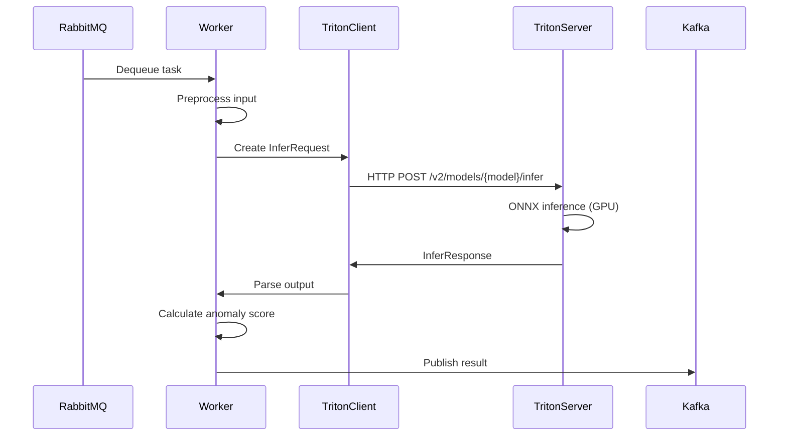

**Celery 설정**:
```python
app = Celery('tasks',
             broker='amqp://rabbitmq:5672',
             backend='rpc://')

@app.task(name='run_inference_task')
def run_inference_task(job_data):
    # Triton 추론 실행
    # 이상점수 계산
    # 결과 Kafka 전송
```

#### Triton Server

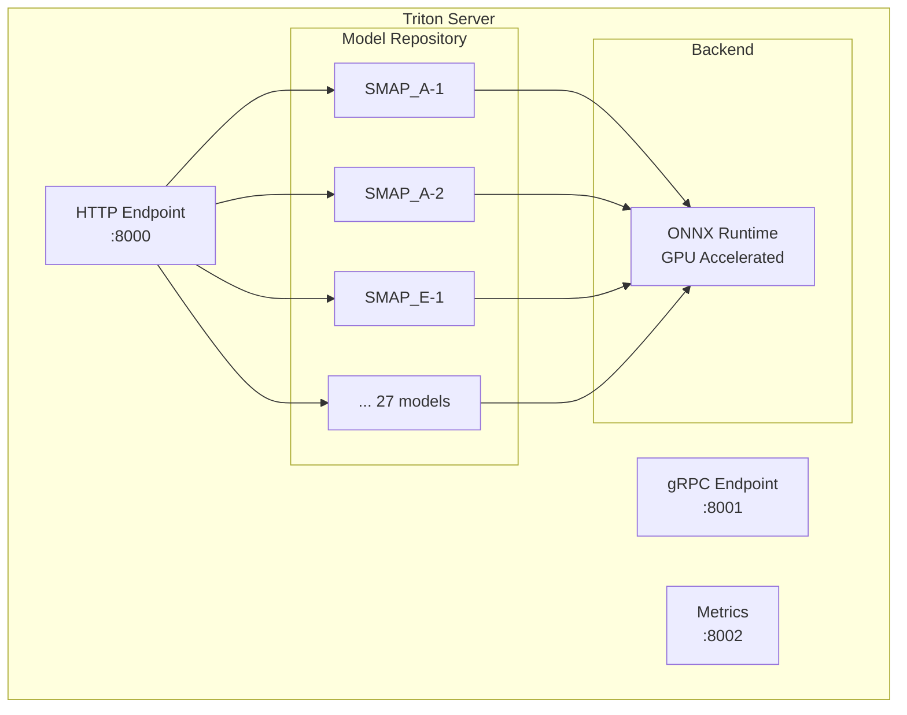

**모델 구조**:
```
triton-repository/onnx/
├── SMAP_A-1/
│   ├── config.pbtxt
│   └── 1/
│       └── model.onnx
├── SMAP_A-2/
...
├── SMAP_T-5/
```

### 4.4 저장 계층

#### Metrics Writer

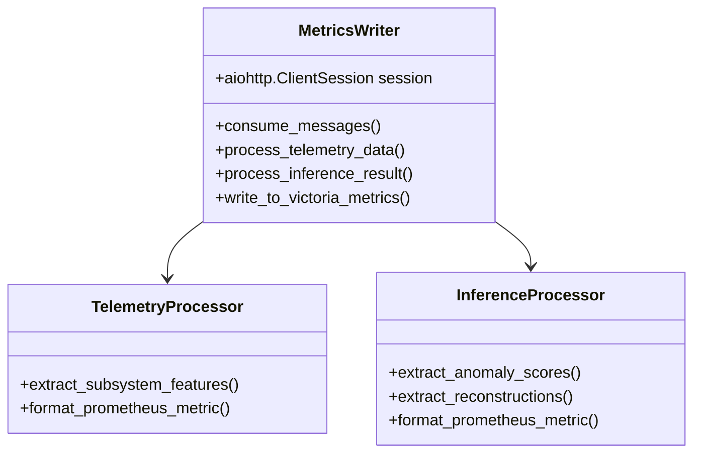

**메트릭 변환**:
```
Kafka Message → Prometheus Format → VictoriaMetrics

Example:
{
  "satellite_id": "sat1",
  "subsystems": {
    "EPS": {"features": [0.5, 0.3, ...]}
  }
}

→

smap_feature{satellite_id="sat1",subsystem="EPS",feature_index="0"} 0.5 1762922535240
smap_feature{satellite_id="sat1",subsystem="EPS",feature_index="1"} 0.3 1762922535240
```

#### VictoriaMetrics Schema

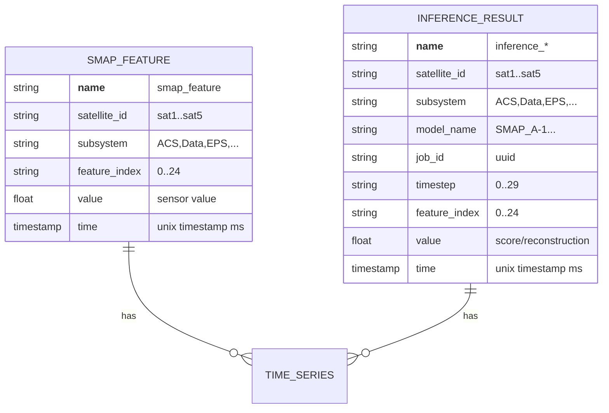

---

## 5. 데이터 모델

### 5.1 텔레메트리 데이터 모델

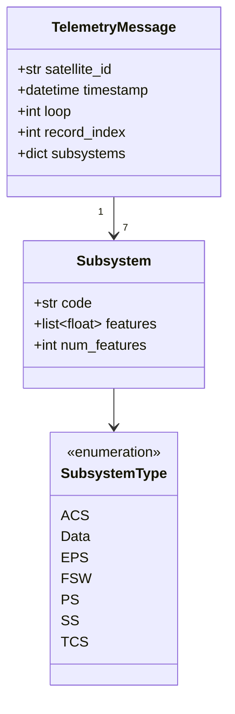

### 5.2 추론 결과 모델

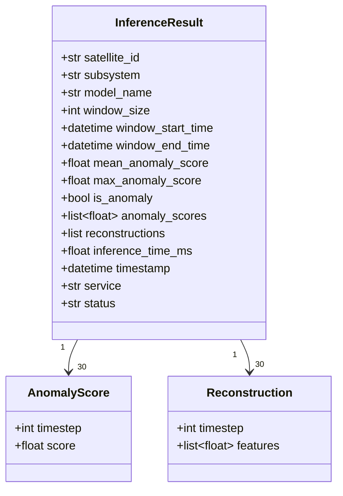

### 5.3 메트릭 스키마

#### 텔레메트리 메트릭

| 메트릭 이름 | 레이블 | 설명 |
|------------|--------|------|
| `smap_feature` | satellite_id, subsystem, feature_index | 센서 특징값 |
| `loop` | satellite_id | 시뮬레이터 루프 번호 |
| `record_index` | satellite_id | 레코드 인덱스 |

#### 추론 메트릭

| 메트릭 이름 | 레이블 | 설명 |
|------------|--------|------|
| `inference_anomaly_detected` | satellite_id, subsystem, model_name | 이상 탐지 여부 (0/1) |
| `inference_anomaly_score` | satellite_id, subsystem, model_name, timestep | 타임스텝별 이상점수 |
| `inference_anomaly_score_mean` | satellite_id, subsystem, model_name | 평균 이상점수 |
| `inference_anomaly_score_max` | satellite_id, subsystem, model_name | 최대 이상점수 |
| `inference_reconstruction` | satellite_id, subsystem, model_name, timestep, feature_index | 특징별 복원값 |
| `inference_reconstruction_mean` | satellite_id, subsystem, model_name, timestep | 타임스텝별 복원값 평균 |
| `inference_time_ms` | satellite_id, subsystem, model_name | 추론 시간 (ms) |

---

## 6. 시퀀스 다이어그램

### 6.1 전체 데이터 흐름

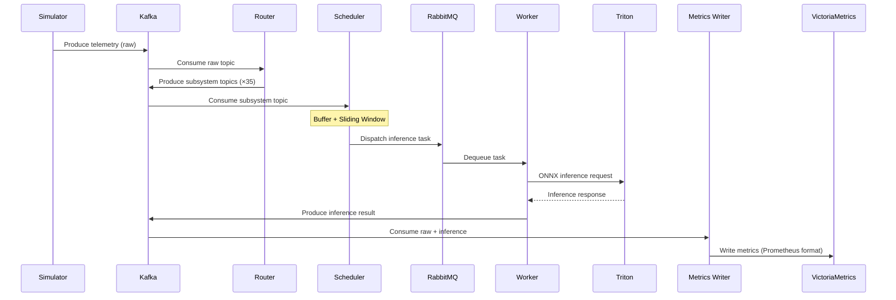

### 6.2 슬라이딩 윈도우 처리

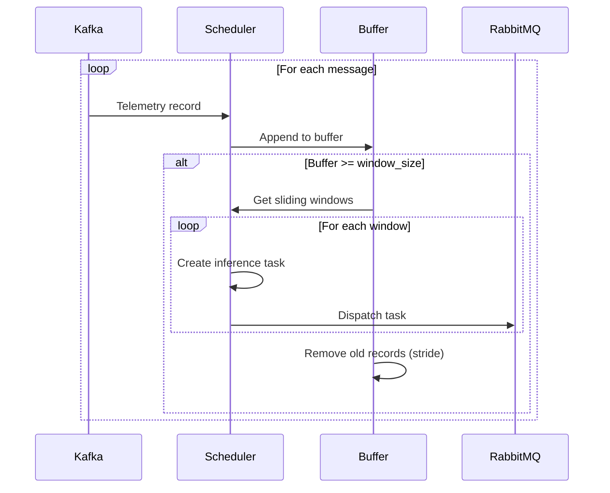

### 6.3 추론 실행 흐름

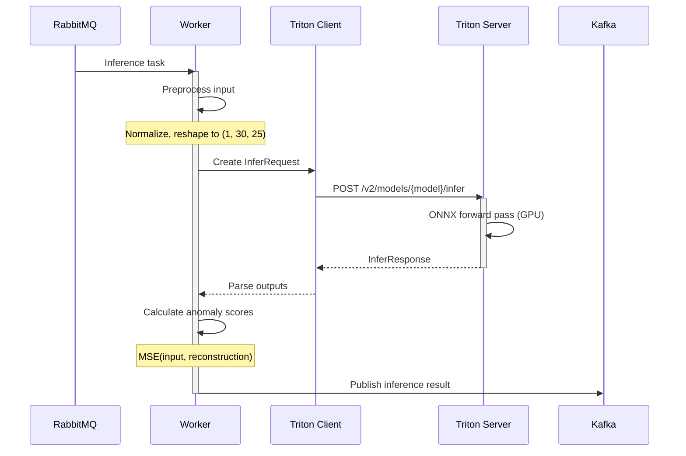

### 6.4 메트릭 저장 흐름

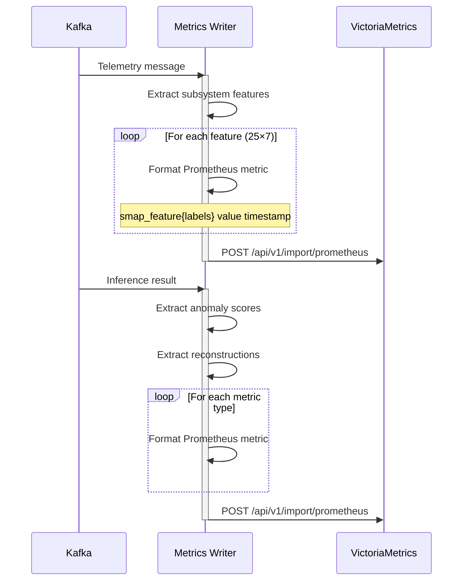

---

## 부록

### A. 성능 특성

| 항목 | 측정값 | 비고 |
|------|--------|------|
| 텔레메트리 처리량 | 5 records/sec | 5 위성 동시 전송 |
| 추론 지연시간 | 50-100ms | Triton GPU 추론 |
| 메트릭 쓰기 속도 | 177 metrics/satellite/sec | VictoriaMetrics |
| 쿼리 응답시간 | 2-8ms | 전체 데이터 쿼리 |
| 시계열 수 | 875개 | 5×7×25 |
| 추론 작업 생성 | ~106 tasks/batch | 슬라이딩 윈도우 |

### B. 확장성 고려사항

#### 수평 확장
- Kafka 파티션 수 증가
- Inference Worker 수 증가 (`docker compose up --scale inference-worker=N`)
- VictoriaMetrics 클러스터 구성

#### 수직 확장
- Triton 서버 GPU 메모리 증가
- VictoriaMetrics 메모리 할당 증가
- Kafka 버퍼 크기 조정

### C. 보안 고려사항

#### 현재 구현
- 로컬 네트워크 격리 (docker bridge network)
- RabbitMQ 기본 인증 (guest/guest)
- PostgreSQL 패스워드 인증

#### 프로덕션 권장사항
- Kafka SSL/TLS 암호화
- RabbitMQ 사용자 권한 관리
- PostgreSQL SSL 연결
- Nginx HTTPS 적용
- JWT 기반 API 인증
- 서비스 간 mTLS
