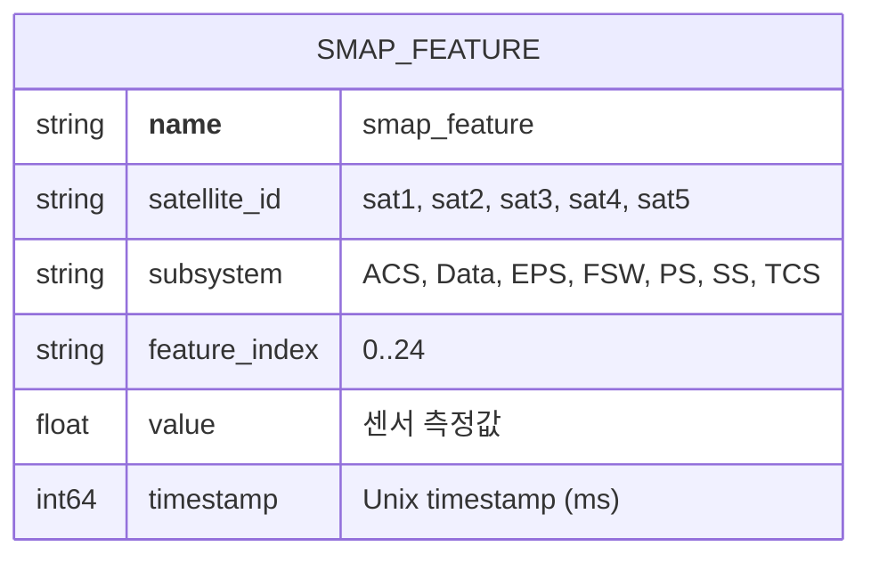
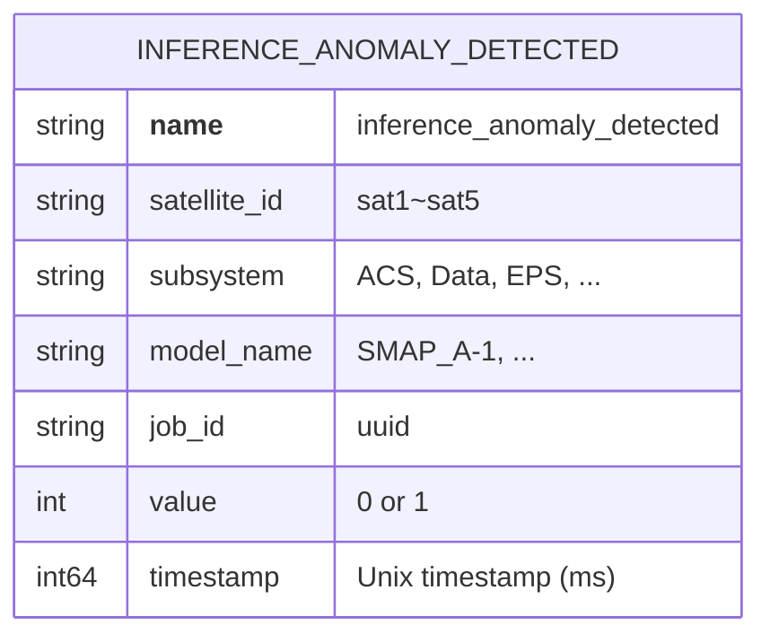

# VictoriaMetrics 데이터베이스 문서

## 목차
1. [개요](#1-개요)
2. [메트릭 스키마](#2-메트릭-스키마)
3. [PromQL 쿼리 가이드](#4-promql-쿼리-가이드)
4. [서비스 모니터링 쿼리](#5-서비스-모니터링-쿼리)
5. [성능 최적화](#6-성능-최적화)
6. [백업 및 복구](#7-백업-및-복구)

---

## 1. 개요

### 1.1 VictoriaMetrics란?

VictoriaMetrics는 Prometheus 호환 시계열 데이터베이스로, 본 시스템에서 다음 데이터를 저장합니다:
- 위성 텔레메트리 데이터 (센서값)
- AI 추론 결과 (이상점수, 복원값)
- 시스템 메트릭

### 1.2 접속 정보

| 항목 | 값 |
|------|------|
| **HTTP API** | http://localhost:8428 |
| **UI (VMUI)** | http://localhost:8428/vmui |
| **데이터 경로** | /victoria-metrics-data |
| **보존 기간** | 1일 (개발 환경) |

### 1.3 시스템 설정

```yaml
# docker-compose.yml
victoria-metrics:
  image: victoriametrics/victoria-metrics:latest
  command:
    - '--storageDataPath=/victoria-metrics-data'
    - '--retentionPeriod=1d'
    - '--search.maxUniqueTimeseries=10000000'
    - '--memory.allowedPercent=80'
  mem_limit: 8g
```

---

## 2. 메트릭 스키마

### 2.1 전체 메트릭 목록

```bash
# 모든 메트릭 이름 조회
curl -s 'http://localhost:8428/api/v1/label/__name__/values' | jq -r '.data[]'
```

**결과**:
```
inference_anomaly_detected
inference_anomaly_score
inference_anomaly_score_max
inference_anomaly_score_mean
inference_reconstruction
inference_reconstruction_mean
inference_time_ms
loop
record_index
smap_feature
```

### 2.2 텔레메트리 메트릭

#### smap_feature

위성 서브시스템의 센서 특징값



**레이블 설명**:
| 레이블 | 값 | 설명 |
|--------|-----|------|
| `satellite_id` | sat1~sat5 | 위성 식별자 |
| `subsystem` | ACS, Data, EPS, FSW, PS, SS, TCS | 서브시스템 |
| `feature_index` | 0~24 | 특징 인덱스 (25개) |

**쿼리 예시**:
```promql
# 모든 텔레메트리
smap_feature

# 특정 위성
smap_feature{satellite_id="sat1"}

# 특정 서브시스템
smap_feature{subsystem="EPS"}

# 특정 특징
smap_feature{feature_index="0"}

# 복합 조건
smap_feature{satellite_id="sat1", subsystem="EPS", feature_index="0"}
```

**시계열 수**:
```
5 satellites × 7 subsystems × 25 features = 875개
```

#### loop, record_index

시뮬레이터 메타데이터

```promql
# 현재 루프 번호
loop{satellite_id="sat1"}

# 현재 레코드 인덱스
record_index{satellite_id="sat1"}
```

### 2.3 추론 결과 메트릭

#### inference_anomaly_detected

이상 탐지 여부 (0: 정상, 1: 이상)



**쿼리 예시**:
```promql
# 모든 이상탐지 결과
inference_anomaly_detected

# 이상만 필터링
inference_anomaly_detected == 1

# 서브시스템별 이상 개수
count(inference_anomaly_detected == 1) by (subsystem)
```

#### inference_anomaly_score_mean

평균 이상점수

**레이블**:
- satellite_id, subsystem, model_name, job_id

**쿼리 예시**:
```promql
# 평균 이상점수
inference_anomaly_score_mean

# 높은 이상점수 (> 4.0)
inference_anomaly_score_mean > 4.0

# 상위 5개
topk(5, inference_anomaly_score_mean)

# 서브시스템별 평균
avg(inference_anomaly_score_mean) by (subsystem)
```

#### inference_anomaly_score_max

최대 이상점수

**쿼리 예시**:
```promql
# 최대 이상점수
inference_anomaly_score_max

# 최대값이 높은 순
topk(10, inference_anomaly_score_max)
```

#### inference_anomaly_score

타임스텝별 이상점수 (30개 타임스텝)

**추가 레이블**:
- `timestep`: "0"~"29"

**쿼리 예시**:
```promql
# 특정 윈도우의 모든 타임스텝
inference_anomaly_score{satellite_id="sat1", subsystem="ACS"}

# 특정 타임스텝
inference_anomaly_score{timestep="15"}

# 타임스텝별 평균
avg(inference_anomaly_score) by (timestep)
```

#### inference_reconstruction

특징별 복원값 (30 timesteps × 25 features)

**추가 레이블**:
- `timestep`: "0"~"29"
- `feature_index`: "0"~"24"

**쿼리 예시**:
```promql
# 특정 특징의 복원값
inference_reconstruction{satellite_id="sat1", subsystem="EPS", feature_index="0"}

# 타임스텝 15의 모든 특징
inference_reconstruction{timestep="15"}
```

#### inference_reconstruction_mean

타임스텝별 복원값 평균

**쿼리 예시**:
```promql
# 타임스텝별 평균 복원값
inference_reconstruction_mean{satellite_id="sat1", subsystem="ACS"}
```

#### inference_time_ms

추론 시간 (밀리초)

**쿼리 예시**:
```promql
# 평균 추론 시간
avg(inference_time_ms)

# 모델별 평균
avg(inference_time_ms) by (model_name)

# 서브시스템별 평균
avg(inference_time_ms) by (subsystem)

# 최근 1시간 추론 시간 추이
inference_time_ms[1h]
```

---

## 3. 데이터 구조

### 3.1 Prometheus 메트릭 포맷

VictoriaMetrics는 Prometheus 포맷으로 데이터를 저장합니다:

```
metric_name{label1="value1", label2="value2"} metric_value timestamp
```

**예시**:
```
smap_feature{satellite_id="sat1",subsystem="EPS",feature_index="0"} 0.5 1762922535240
inference_anomaly_detected{satellite_id="sat1",subsystem="ACS",model_name="SMAP_A-1"} 1 1762922535240
```

### 3.2 타임스탬프 형식

- **저장 형식**: Unix timestamp (밀리초)
- **예시**: `1762922535240` = 2025-11-12 13:55:35.240 UTC

**변환**:
```bash
# 현재 시각을 Unix timestamp로
date +%s%3N

# Unix timestamp를 날짜로
date -d @1762922535

# PromQL에서 현재 시각
time()
```

### 3.3 Value 배열 구조

쿼리 결과에서 `value` 배열은 `[timestamp, metric_value]` 형식입니다:

```json
{
  "metric": {
    "__name__": "smap_feature",
    "satellite_id": "sat1",
    "subsystem": "EPS",
    "feature_index": "0"
  },
  "value": [1762922535.24, "0.5"]
}
```

- **value[0]**: Unix timestamp (초, 소수점 포함)
- **value[1]**: 메트릭 값 (문자열)

---

## 4. PromQL 쿼리 가이드

### 4.1 기본 쿼리

#### 즉시 쿼리 (Instant Query)

```bash
# API 엔드포인트
GET /api/v1/query?query=<promql>&time=<timestamp>

# 예시
curl -s 'http://localhost:8428/api/v1/query?query=smap_feature{satellite_id="sat1"}' | jq
```

#### 범위 쿼리 (Range Query)

```bash
# API 엔드포인트
GET /api/v1/query_range?query=<promql>&start=<timestamp>&end=<timestamp>&step=<duration>

# 예시
curl -s 'http://localhost:8428/api/v1/query_range?query=smap_feature{satellite_id="sat1"}&start=1762922000&end=1762923000&step=30' | jq
```

### 4.2 레이블 필터링

#### 등호 매칭 (=)
```promql
smap_feature{satellite_id="sat1"}
```

#### 부등호 매칭 (!=)
```promql
smap_feature{satellite_id!="sat1"}
```

#### 정규표현식 매칭 (=~)
```promql
# EPS 또는 ACS
smap_feature{subsystem=~"EPS|ACS"}

# sat로 시작
smap_feature{satellite_id=~"sat.*"}
```

#### 정규표현식 제외 (!~)
```promql
smap_feature{subsystem!~"Data|FSW"}
```

### 4.3 집계 함수

#### sum (합계)
```promql
# 서브시스템별 합계
sum(smap_feature) by (subsystem)
```

#### avg (평균)
```promql
# 위성별 평균
avg(smap_feature) by (satellite_id)

# 전체 평균
avg(smap_feature)
```

#### count (개수)
```promql
# 이상 개수
count(inference_anomaly_detected == 1)

# 서브시스템별 이상 개수
count(inference_anomaly_detected == 1) by (subsystem)
```

#### min, max (최소/최대)
```promql
# 최소값
min(smap_feature)

# 최대값
max(inference_anomaly_score_mean)
```

#### topk, bottomk (상위/하위 K개)
```promql
# 이상점수 상위 5개
topk(5, inference_anomaly_score_mean)

# 추론시간 하위 3개
bottomk(3, inference_time_ms)
```

### 4.4 산술 연산

```promql
# 덧셈
smap_feature + 10

# 곱셈 (정규화)
smap_feature * 0.5

# 비율
inference_anomaly_score_mean / inference_anomaly_score_max

# 두 메트릭 간 연산
smap_feature - inference_reconstruction
```

### 4.5 비교 연산

```promql
# 이상점수 > 4.0
inference_anomaly_score_mean > 4.0

# 범위 필터링
inference_anomaly_score_mean > 1.0 and inference_anomaly_score_mean < 5.0

# 복합 조건
inference_anomaly_detected == 1 and inference_anomaly_score_mean > 4.0
```

### 4.6 시간 범위 쿼리

#### Range Vector (범위 벡터)
```promql
# 최근 5분
smap_feature[5m]

# 최근 1시간
inference_time_ms[1h]

# 최근 1일
inference_anomaly_score_mean[1d]
```

#### rate (변화율)
```promql
# 1분당 변화율
rate(smap_feature[5m])

# 추론 속도 (inferences/sec)
rate(inference_time_ms[5m])
```

#### increase (증가량)
```promql
# 5분간 증가량
increase(record_index[5m])
```

#### delta (차이)
```promql
# 5분간 변화량
delta(smap_feature[5m])
```

### 4.7 고급 함수

#### absent (메트릭 부재 확인)
```promql
# sat6가 없으면 1
absent(smap_feature{satellite_id="sat6"})
```

#### histogram_quantile (백분위수)
```promql
# 90th percentile 추론 시간
histogram_quantile(0.9, inference_time_ms)
```

#### predict_linear (선형 예측)
```promql
# 1시간 후 예측값
predict_linear(smap_feature[5m], 3600)
```

---

## 5. 서비스 모니터링 쿼리

### 5.1 서비스 정상 동작 확인

#### 데이터 수신 확인
```promql
# 최근 1분간 텔레메트리 데이터 있음
count(smap_feature offset 1m) > 0

# 위성별 데이터 수신
count(smap_feature) by (satellite_id)

# 서브시스템별 데이터 수신
count(smap_feature) by (subsystem)
```

#### 추론 실행 확인
```promql
# 최근 1분간 추론 결과 있음
count(inference_anomaly_detected offset 1m) > 0

# 최근 5분간 추론 개수
count(increase(inference_time_ms[5m]))

# 모델별 추론 개수
count(inference_time_ms) by (model_name)
```

### 5.2 시스템 상태 모니터링

#### 데이터 처리 속도
```promql
# 초당 텔레메트리 레코드 수
rate(record_index[1m])

# 분당 추론 개수
rate(inference_time_ms[5m]) * 60
```

#### 추론 성능
```promql
# 평균 추론 시간
avg(inference_time_ms)

# 모델별 평균 추론 시간
avg(inference_time_ms) by (model_name)

# 95th percentile 추론 시간
quantile(0.95, inference_time_ms)

# 추론 시간 > 100ms인 경우
count(inference_time_ms > 100)
```

#### 이상탐지 상태
```promql
# 현재 이상 개수
count(inference_anomaly_detected == 1)

# 이상 비율
count(inference_anomaly_detected == 1) / count(inference_anomaly_detected)

# 서브시스템별 이상 비율
count(inference_anomaly_detected == 1) by (subsystem) / count(inference_anomaly_detected) by (subsystem)

# 최근 10분간 이상 발생 추이
increase(inference_anomaly_detected[10m])
```

### 5.3 데이터 품질 확인

#### 결측값 확인
```promql
# 특정 위성 데이터 없음
absent(smap_feature{satellite_id="sat1"})

# 서브시스템 데이터 없음
absent(smap_feature{subsystem="EPS"})
```

#### 데이터 범위 확인
```promql
# 이상치 (너무 큰 값)
smap_feature > 1000

# 음수값
smap_feature < 0

# 특징별 최대/최소값
max(smap_feature) by (feature_index)
min(smap_feature) by (feature_index)
```

### 5.4 알람 규칙

#### 높은 이상점수
```promql
# 이상점수 > 4.0 지속 5분
inference_anomaly_score_mean > 4.0

# ALERT: HighAnomalyScore
alert: HighAnomalyScore
expr: inference_anomaly_score_mean > 4.0
for: 5m
annotations:
  summary: "High anomaly score detected"
  description: "{{ $labels.satellite_id }} {{ $labels.subsystem }}: {{ $value }}"
```

#### 데이터 수신 중단
```promql
# 최근 2분간 데이터 없음
absent(smap_feature offset 2m)

# ALERT: NoTelemetryData
alert: NoTelemetryData
expr: absent(smap_feature offset 2m)
for: 2m
annotations:
  summary: "No telemetry data received"
```

#### 추론 실패
```promql
# 최근 5분간 추론 없음
absent(inference_time_ms offset 5m)

# ALERT: InferenceNotRunning
alert: InferenceNotRunning
expr: absent(inference_time_ms offset 5m)
for: 5m
annotations:
  summary: "Inference not running"
```

---

## 6. 성능 최적화

### 6.1 쿼리 최적화

#### 레이블 필터링 먼저
```promql
# 좋음: 먼저 필터링
smap_feature{satellite_id="sat1"} > 0.5

# 나쁨: 먼저 계산
smap_feature > 0.5{satellite_id="sat1"}  # 문법 오류
```

#### 집계 시 by 사용
```promql
# 좋음: 필요한 레이블만
avg(smap_feature) by (subsystem)

# 나쁨: 모든 레이블 유지
avg(smap_feature)  # 시계열 수 그대로
```

#### 시간 범위 제한
```promql
# 좋음: 최근 5분만
rate(smap_feature[5m])

# 나쁨: 너무 긴 범위
rate(smap_feature[24h])  # 느림
```

### 6.2 카디널리티 관리

현재 시계열 수:
```bash
# 총 시계열 수
curl -s 'http://localhost:8428/api/v1/query?query=count(smap_feature)' | jq -r '.data.result[0].value[1]'
# 결과: 875

# 메트릭별 시계열 수
curl -s 'http://localhost:8428/api/v1/query?query=count({__name__=~".+"}) by (__name__)' | jq
```

**권장 사항**:
- 레이블 값은 제한된 집합 사용 (satellite_id, subsystem 등)
- 동적 레이블(UUID, timestamp 등) 지양
- 현재 구조는 최적화되어 있음 (875개 시계열)

### 6.3 메모리 설정

```yaml
# docker-compose.yml
victoria-metrics:
  mem_limit: 8g
  command:
    - '--memory.allowedPercent=80'
    - '--search.maxUniqueTimeseries=10000000'
```

**모니터링**:
```bash
# 메모리 사용량
curl -s 'http://localhost:8428/metrics' | grep vm_memory

# 캐시 사용량
curl -s 'http://localhost:8428/metrics' | grep vm_cache
```

---

## 7. 백업 및 복구

### 7.1 스냅샷 생성

```bash
# 스냅샷 생성
curl -X POST http://localhost:8428/snapshot/create

# 응답: {"status":"ok","snapshot":"20251112-101530-ABC123"}
```

### 7.2 데이터 백업

```bash
# 볼륨 백업
docker run --rm \
  -v telemetry_anomaly_det_victoria_data:/source:ro \
  -v $(pwd)/backups:/backup \
  alpine \
  tar czf /backup/victoria-backup-$(date +%Y%m%d).tar.gz -C /source .
```

### 7.3 데이터 복구

```bash
# 볼륨 복원
docker run --rm \
  -v telemetry_anomaly_det_victoria_data:/target \
  -v $(pwd)/backups:/backup:ro \
  alpine \
  tar xzf /backup/victoria-backup-20251112.tar.gz -C /target
```

### 7.4 데이터 정리

```bash
# 모든 데이터 삭제 (주의!)
docker compose stop victoria-metrics
docker volume rm telemetry_anomaly_det_victoria_data
docker compose up -d victoria-metrics
```

---

## 부록

### A. API 엔드포인트 목록

| 엔드포인트 | 설명 |
|-----------|------|
| `/api/v1/query` | 즉시 쿼리 |
| `/api/v1/query_range` | 범위 쿼리 |
| `/api/v1/series` | 시계열 메타데이터 |
| `/api/v1/labels` | 레이블 목록 |
| `/api/v1/label/<name>/values` | 레이블 값 목록 |
| `/api/v1/import/prometheus` | 데이터 쓰기 (Prometheus 포맷) |
| `/metrics` | VictoriaMetrics 자체 메트릭 |
| `/snapshot/create` | 스냅샷 생성 |

### B. 유용한 curl 명령어

```bash
# 메트릭 이름 목록
curl -s 'http://localhost:8428/api/v1/label/__name__/values' | jq -r '.data[]'

# 레이블 목록
curl -s 'http://localhost:8428/api/v1/labels' | jq -r '.data[]'

# satellite_id 목록
curl -s 'http://localhost:8428/api/v1/label/satellite_id/values' | jq -r '.data[]'

# 시계열 메타데이터
curl -s 'http://localhost:8428/api/v1/series?match[]=smap_feature{satellite_id="sat1"}' | jq

# 즉시 쿼리
curl -s 'http://localhost:8428/api/v1/query?query=smap_feature' | jq

# 범위 쿼리
curl -s 'http://localhost:8428/api/v1/query_range?query=smap_feature&start=1762922000&end=1762923000&step=30' | jq
```

### C. VMUI 사용 팁

1. **접속**: http://localhost:8428/vmui
2. **쿼리 입력**: PromQL 쿼리 입력
3. **시간 범위**: 우측 상단에서 조정 (5m, 1h, 1d, custom)
4. **그래프 타입**: Table, Graph, JSON 선택
5. **다중 쿼리**: "+ Add query" 버튼으로 여러 쿼리 동시 표시

### D. 문제 해결

#### 쿼리가 느림
```bash
# 인덱스 크기 확인
curl -s 'http://localhost:8428/metrics' | grep vm_index_blocks

# 쿼리 시간 제한 늘리기
--search.maxQueryDuration=60s
```

#### 메모리 부족
```bash
# 메모리 사용량 확인
docker stats victoria-metrics

# 메모리 제한 늘리기 (docker-compose.yml)
mem_limit: 16g
```

#### 데이터가 저장되지 않음
```bash
# metrics-writer 로그 확인
docker compose logs metrics-writer --tail=50

# VictoriaMetrics 로그 확인
docker compose logs victoria-metrics --tail=50

# 쓰기 테스트
echo 'test_metric 123' | curl --data-binary @- 'http://localhost:8428/api/v1/import/prometheus'
```
